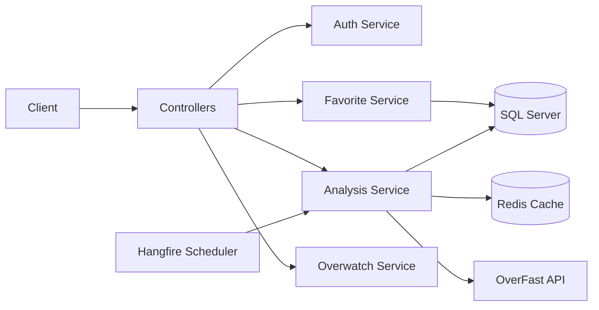
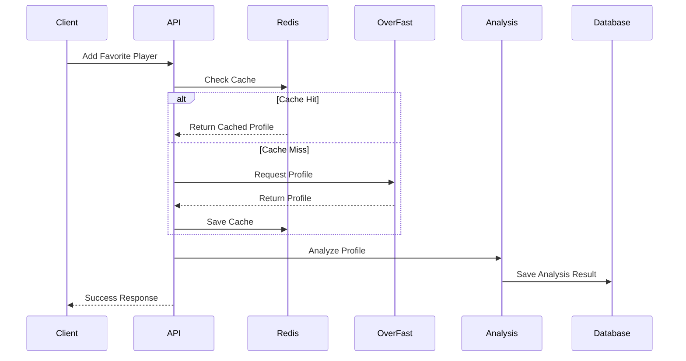
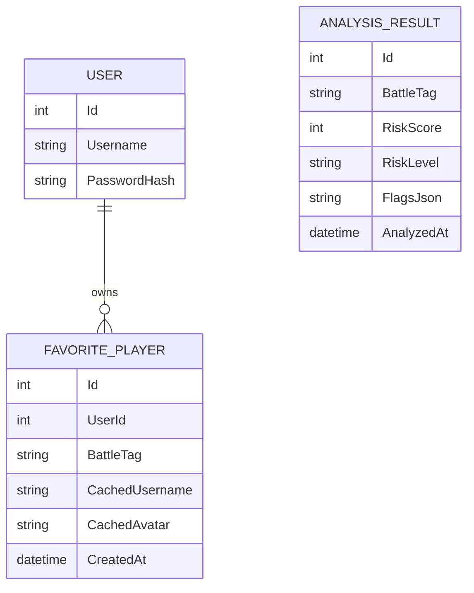
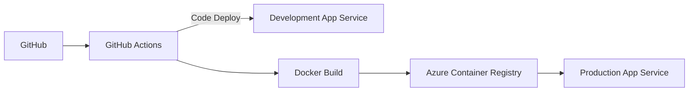

# Shooter Platform API

Backend API for analyzing Overwatch player profiles and managing favorite players.

This project demonstrates practical backend engineering through real-world API integration, caching, authentication, asynchronous processing, database optimization, and cloud deployment.

---

# Live Demo

| Environment | Description | Swagger |
|-------------|-------------|----------|
| Development | GitHub Actions → Azure App Service (Code Deploy) | https://shooter-api-dev-g3h4hphffqg9dxb7.koreacentral-01.azurewebsites.net/swagger|
| Production | GitHub Actions → Docker → Azure Container Registry → Azure App Service | https://shooter-api-prod-eyaucngkhfd6bdcy.koreacentral-01.azurewebsites.net/swagger|

---

# Highlights

- ASP.NET Core 10 REST API
- JWT Authentication
- Entity Framework Core
- SQL Server
- Redis Distributed Cache
- Hangfire Background Jobs
- Docker Containerization
- Azure App Service Deployment
- GitHub Actions CI/CD
- N+1 Query Optimization
- Controlled Parallel Processing (SemaphoreSlim)
- API Rate Limiting

---

# Tech Stack

| Category | Technology |
|----------|------------|
| Backend | ASP.NET Core 10 |
| Language | C# |
| ORM | Entity Framework Core |
| Database | SQL Server |
| Cache | Redis |
| Authentication | JWT |
| Background Jobs | Hangfire |
| API Documentation | Swagger |
| Container | Docker |
| Deployment | Azure App Service |
| CI/CD | GitHub Actions |

---

# System Architecture



---

# Request Flow



---

# Database



---

# Deployment Pipeline



---

# Features

- JWT Authentication
- Favorite Player Management
- Overwatch Profile Analysis
- Redis Profile Cache
- Analysis Result Persistence
- Scheduled Analysis Refresh (Hangfire)
- API Rate Limiting
- Global Exception Middleware
- Swagger Documentation
- Health Check Endpoint

---

# Engineering Decisions

## N+1 Query Optimization

### Problem

Each favorite player requested its analysis result individually, resulting in an N+1 query issue.

### Solution

- Retrieve all BattleTags first.
- Load analysis results with a single SQL query using `IN`.
- Build a Dictionary for O(1) lookup.

### Result

- Reduced database round trips.
- Improved query performance.

---

## Controlled Parallel Processing

### Problem

Player analysis was processed sequentially.

```
Player1
 ↓
Player2
 ↓
Player3
```

As the number of favorite players increased, total processing time increased linearly.

### Solution

Implemented controlled parallel processing using `SemaphoreSlim`.

```
Player1   Player2   Player3   Player4   Player5

                ↓

           Next Batch
```

### Result

- Improved throughput.
- Limited concurrent external API requests.
- Better server resource utilization.

---

## Redis Cache

### Problem

The same player profile was repeatedly requested from the external API.

### Solution

Cached profile data in Redis before calling the OverFast API.

### Result

- Reduced external API requests.
- Lower latency.
- Faster response time.

---

## Rate Limiting

### Problem

Public APIs could receive excessive requests.

### Solution

Applied ASP.NET Core Rate Limiter policies for authentication, analysis, and profile endpoints.

### Result

- Protected API resources.
- Prevented abuse.

---

## Background Jobs

### Problem

Player analysis needed to be refreshed periodically.

### Solution

Implemented scheduled background jobs using Hangfire.

### Result

- Automatic analysis refresh.
- Reliable scheduled processing.

---

# Project Structure

```
Application
│
├── Common
├── Features
│   ├── Auth
│   ├── Favorite
│   ├── Analysis
│   └── Overwatch
│
Infrastructure
│
Middlewares
│
Options
```

---

# Future Improvements

- Polly Retry Policy
- Bulk Analysis Processing
- Kafka Event Processing
- OpenTelemetry
- Prometheus Monitoring
- Dashboard Statistics